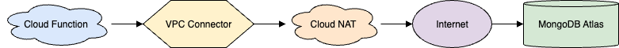
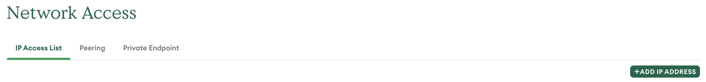
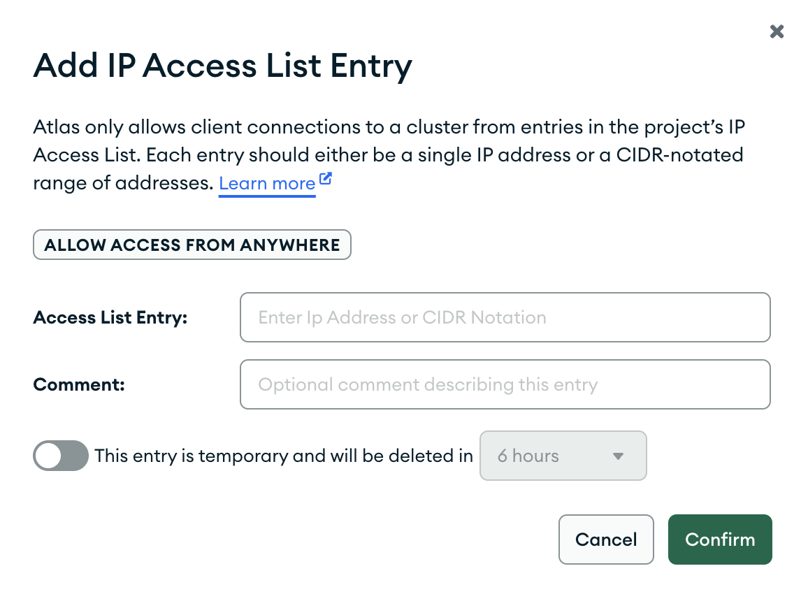

# Cloud Function to MongoDB Atlas

MongoDB Atlas does not permit an open all connection to the database. To connect a service to the database, a white list should be configured at MongoDB Atlas, and a static IP address should be provided to the Cloud function. The next steps walk you through the set up to configure the connection.



## Reserve a Static IP

```bash
gcloud compute addresses create venue-searchpos-mongo-ip \
  --region=europe-southwest1
```

Check the reserved IP:

```bash
gcloud compute addresses describe venue-searchpos-mongo-ip \
  --region=europe-southwest1 \
  --format="get(address)"
```

Output:

`34.175.240.54`

## Create a VPC Network

Use the `default` VPC network or, create a new one:

```bash
gcloud compute networks create venue-searchpos-vpc \
  --subnet-mode=custom
```

Or use a current one in case you are in possibility.

### Create a subnet

```bash
gcloud compute networks subnets create venue-seachpos-vpc-subnet \
  --network=venue-searchpos-vpc \
  --range=10.8.0.0/28 \
  --region=europe-southwest1
```

## Create a VPC Serverless Access Connector

```bash
# gcloud compute networks vpc-access connectors create venue-searchpos-connector \
#   --region=europe-southwest1 \
#   --network=venue-searchpos-vpc \
#   --range=10.8.0.0/28

gcloud compute networks vpc-access connectors create venue-searchpos-connector \
  --region=europe-southwest1 \
  --network=default \
  --range=10.8.0.0/28

Create request issued for: [venue-searchpos-connector]
Waiting for operation [projects/lfs261-cicd-304112/locations/europe-southwest1/operations/79ea1692-c485-453e-b9fe-9f8a43506a0b] to complete...done.                      
Created connector [venue-searchpos-connector].
```

### Create a Cloud Router

```bash
# gcloud compute routers create venue-searchpos-router \
#   --network=venue-searchpos-vpc \
#   --region=europe-southwest1

gcloud compute routers create venue-searchpos-router \
  --network=default \
  --region=europe-southwest1

NAME                    REGION             NETWORK
venue-searchpos-router  europe-southwest1  default

```

## Set Up Cloud NAT with the Static IP

```bash
gcloud compute routers nats create venue-searchpos-nat \
  --router=venue-searchpos-router \
  --region=europe-southwest1 \
  --auto-allocate-nat-external-ips \
  --nat-all-subnet-ip-ranges \
  --enable-logging

Creating NAT [venue-searchpos-nat] in router [venue-searchpos-router]...done.
```

## Deploy Your Cloud Function Using the VPC Connector

```bash
gcloud functions deploy venue-searchpos-service \
  --region=europe-southwest1 \
  --runtime go123 \
  --trigger-http \
  --entry-point=EntryPoint \
  --vpc-connector=venue-searchpos-connector \
  --egress-settings=all \
  --set-secrets MONGO_URI=mongodb-supporters-uri:latest
  --allow-unauthenticated
```

### Useful Tip

Test IP from inside the cloud function

```go
http.Get("https://api.ipify.org?format=text")
```

## Configure MongoDB Atlas IP allowlist

Includes the static IP you reserved earlier in MongoDB Atlas.

Go to your MongoDB instance, and point to the Security->Network Access:



Add the static IP address from GCP



### Verify the connection

Prpare a new function to validate. 

```go 
package main

import (
    "context"
    "fmt"
    "log"
    "net/http"
    "os"
    "time"

    "go.mongodb.org/mongo-driver/mongo"
    "go.mongodb.org/mongo-driver/mongo/options"
)

var mongoClient *mongo.Client

func init() {
    uri := os.Getenv("MONGO_URI")
    ctx, cancel := context.WithTimeout(context.Background(), 10*time.Second)
    defer cancel()

    client, err := mongo.Connect(ctx, options.Client().ApplyURI(uri))
    if err != nil {
        log.Fatalf("Failed to connect to MongoDB: %v", err)
    }

    // Ping the database to test connectivity
    if err := client.Ping(ctx, nil); err != nil {
        log.Fatalf("Ping failed: %v", err)
    }

    mongoClient = client
    log.Println("✅ Successfully connected and pinged MongoDB")
}

func MongoCheckHandler(w http.ResponseWriter, r *http.Request) {
    fmt.Fprint(w, "✅ MongoDB connection is valid\n")
}
```

Deploy the function:

```bash
gcloud functions deploy venue-searchpos-service \
  --region=europe-southwest1 \
  --runtime=go121 \
  --entry-point=MongoCheckHandler \
  --trigger-http \
  --allow-unauthenticated \
  --vpc-connector=my-connector \
  --egress-settings=all \
  --set-secrets MONGO_URI=mongodb-supporters-uri:latest
  ```

Test the endpoint

`curl https://europe-southwest1-YOUR_PROJECT.cloudfunctions.net/venue-searchpos-service`

You should get:

`✅ MongoDB connection is valid`